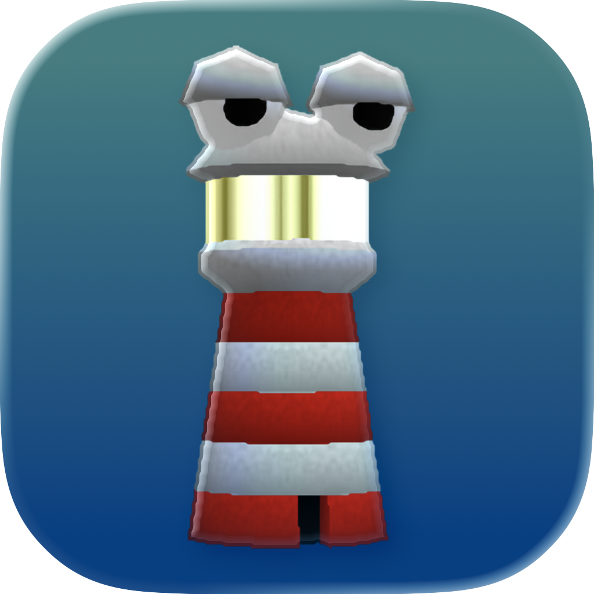
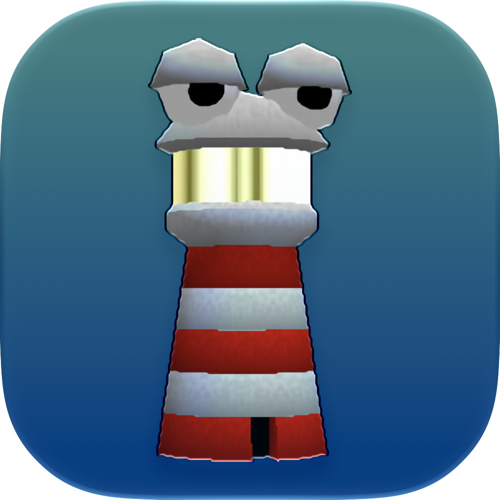

<p align="center">
  
  &nbsp;&nbsp;&nbsp;
  
  <br>
  <sub><b>Liquid Glass app icon</b> &nbsp;—&nbsp; macOS 26 Tahoe (left) &nbsp;·&nbsp; macOS 27 Golden Gate (right)</sub>
</p>

# Lighthouse — macOS

A macOS-optimized fork of [HarbourMasters/Lighthouse](https://github.com/HarbourMasters/Lighthouse)
(the *Banjo-Kazooie* PC port, built on [libultraship](https://github.com/Kenix3/libultraship)).

The goal of this fork is simple: **a plain build produces a self-contained, codesigned
`Lighthouse.app`** that launches on any modern Apple-Silicon Mac with no extra setup — plus crisp
Retina text, a native Liquid Glass icon, an input fix, and the build fixes needed for a current
Apple-clang / CMake toolchain. Gameplay, assets, and the rest of the project are unchanged from
upstream — you still provide your own *Banjo-Kazooie* ROM.

---

## Download & run

1. Grab the latest `Lighthouse-vX.Y.Z-macOS-arm64.zip` from
   [Releases](https://github.com/quarrel07/Lighthouse-macOS/releases) and unzip it.
2. The app is **ad-hoc codesigned**, so on first launch right-click `Lighthouse.app` → **Open**
   (or run `xattr -dr com.apple.quarantine Lighthouse.app`) to get past Gatekeeper.
3. On first run the game asks for a supported **Banjo-Kazooie ROM** (`.z64` — US 1.0/1.1, JP, or PAL).
   It extracts `bk.o2r` into `~/Library/Application Support/com.lighthouse/` — this can take a
   minute — then boots straight to the game.

No copyrighted assets are bundled. You must supply your own legally-dumped ROM.

## What this fork changes

| # | Area | Fix |
|---|------|-----|
| 1 | **libultraship** `cmake/dependencies/mac.cmake` | A stale `/Library/Frameworks/SDL2.framework` can win `find_package(SDL2)` over Homebrew's and break configure. Search frameworks last and add the Homebrew prefix to `CMAKE_PREFIX_PATH`. |
| 2 | **Crisp Retina menu text** (`libultraship`, `src/port/Engine.cpp`) | The ImGui overlay was rasterized at logical point size and stretched to the Retina framebuffer → fuzzy menus. Detect the display backing scale (`Gui::GetDpiScale`, set in `Fast3dGui::Init`) and rasterize every font (`ImFontConfig::RasterizerDensity`) at that scale. The menu fonts are baked at `backingScale × maxUiScale` so text also stays sharp at every **ImGui scale** option, not just the default. |
| 3 | **Press-and-hold accent popup** `src/port/Game.cpp` | Holding a movement key (WASD) popped up the macOS accent/diacritic picker, because SDL keeps a Cocoa text-input context active. Disable the per-app `ApplePressAndHoldEnabled` default at startup — key repeat still works, the popup is gone. |
| 4 | **Packaging** `cmake/macos/apple_bundle.cmake` | Build a self-contained `.app`: set `MACOSX_BUNDLE`, compile the Liquid Glass icon, bundle `lighthouse.o2r` + `config.yml` + the first-run extractor's `assets/` into `Contents/Resources`, relink Homebrew dylibs into `Contents/Frameworks`, and ad-hoc codesign. Homebrew's `sdl2` is now **sdl2-compat**, which `dlopen`s SDL3 at runtime — `fixup_bundle` can't see a `dlopen`, so `libSDL3.dylib` is copied in by hand (otherwise the app aborts with *"Failed loading SDL3 library."*). |
| 5 | **Liquid Glass app icon** `macosx/lighthouseicon.icon` | A native [Icon Composer](https://developer.apple.com/documentation/Xcode/creating-your-app-icon-using-icon-composer) icon compiled with `actool` into `Assets.car` (+ a flattened `.icns` for older systems), so the Dock/Finder icon uses the real macOS 26+ Liquid Glass material instead of a flat PNG. On toolchains without `.icon` support the build falls back to a flat icns from upstream's `logo.png`. |
| 6 | **Metadata** `macosx/Info.plist.in` | The bundle plist now carries the real project version (upstream's static `Info.plist` is pinned at `0.1.0`, so Finder's Get Info always disagreed with the app), plus `CFBundleIconName = lighthouseicon` and the HiDPI capability keys. |
| 7 | **Clean quit** `src/port/Engine.cpp` | Declining the first-run ROM prompt (and the other extraction bail-outs) called `exit()`, which runs static destructors: the libultraship `Context` singleton then logs from `~Context()` after spdlog's own statics are gone → **segfault on a clean quit**. The `RunExtract` bail-outs now use `_Exit()`. |
| 8 | **Live ImGui menu scaling** `src/port/UI/LighthouseMenuSettings.cpp` | The "ImGui Menu Scaling" option changed the setting but the callback that applies it was commented out upstream, so nothing happened until the next launch. The callback is enabled (same wiring 2 Ship 2 Harkinian ships). |

One fix the other quarrel07 port forks carry is **not needed here** — upstream Lighthouse already
sets the writable data folder via `LSEnvironment SHIP_HOME`.

## File layout at runtime

* **`Lighthouse.app/Contents/Resources`** (read-only) — `lighthouse.o2r` (port assets), `config.yml` +
  `assets/` (the definitions the first-run ROM extractor needs), `gamecontrollerdb.txt`, and the
  compiled icon (`Assets.car`, `lighthouseicon.icns`).
* **`~/Library/Application Support/com.lighthouse/`** (writable) — `bk.o2r` extracted from your ROM on
  first run, plus config, save data, logs, and the `mods/` folder.

## Building it yourself

```bash
brew install cmake ninja sdl2 sdl3 sdl2_net libpng glew libzip nlohmann-json tinyxml2 spdlog libogg libvorbis boost
git clone --recurse-submodules https://github.com/quarrel07/Lighthouse-macOS.git
cd Lighthouse-macOS
cmake --no-warn-unused-cli -H. -Bbuild-cmake -GNinja -DCMAKE_BUILD_TYPE=Release
cmake --build build-cmake --target Lighthouse   # produces build-cmake/Lighthouse.app
```

A fresh recursive clone builds turnkey — the submodule fix lives on a fork that `.gitmodules` already
points at, so no manual patching is needed. `sdl3` is required at build time because the bundled
sdl2-compat shim loads it. The Liquid Glass icon step needs **full Xcode 26+** installed (for
`actool`); the rest builds with the Command Line Tools. Pass `-DLIGHTHOUSE_BUNDLE_DEPS=OFF` to skip
the dylib/SDL3 bundling for a local-only build that uses your Homebrew libraries directly.

## Submodule fork used

| Submodule | Fork / branch | Change |
|-----------|---------------|--------|
| `libultraship` | [`quarrel07/libultraship@lighthouse-libus`](https://github.com/quarrel07/libultraship/tree/lighthouse-libus) | SDL2 framework build fix (#1) + HiDPI font density (#2) |

The fork branches from the exact commit upstream Lighthouse pins, so this fork tracks upstream with
only the macOS-specific deltas above. `Torch` is unchanged and still points at upstream.

## Credits

All credit for Lighthouse goes to the **[HarbourMasters](https://github.com/HarbourMasters)** team and
contributors, and to **[Kenix3](https://github.com/Kenix3)** / the libultraship project. This fork
only adds macOS build, packaging, and quality-of-life fixes.
